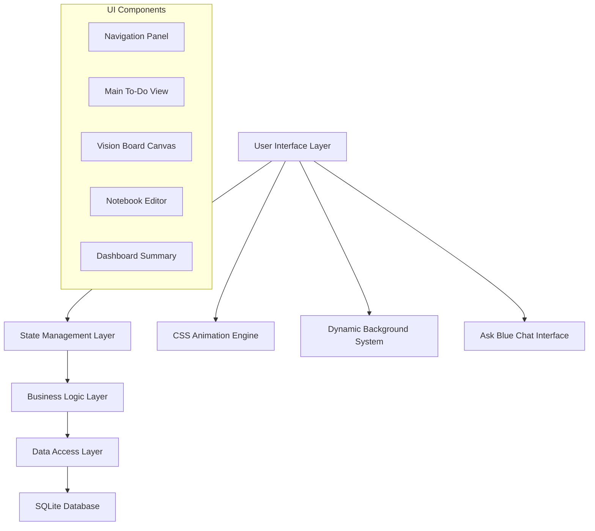

# Design Document

## Overview

The aesthetic UI redesign transforms BlueNest into a modern, visually appealing productivity application with a focus on seamless user experience. The design emphasizes a Microsoft Teams-like to-do interface as the primary view, enhanced with dynamic backgrounds, smooth animations, and an integrated AI assistant. The architecture maintains the existing SQLAlchemy backend while completely overhauling the frontend presentation layer.

## Architecture

### High-Level Architecture



### Component Hierarchy

- **App Container**: Root component with dynamic background
  - **Navigation Panel**: Left sidebar with user/mode selection
  - **Main Content Area**: Context-sensitive based on navigation
    - **To-Do List View**: Primary interface (Teams-like)
    - **Vision Board**: Canvas-style content area
    - **Dashboard**: Summary and insights view
  - **Secondary Panel**: Right-side contextual content
    - **Ask Blue**: Floating chat interface
    - **Notebook**: Rich text editor

## Components and Interfaces

### 1. Dynamic Background System

**Purpose**: Provide aesthetic, changing backgrounds that enhance visual appeal

**Implementation**:
- CSS-based gradient animations with daily rotation
- Multiple background themes stored as CSS classes
- Date-based selection algorithm for consistent daily themes
- Smooth transitions between background states

```python
def get_daily_background_theme(date: dt.date) -> str:
    """Return CSS class name for daily background theme"""
    themes = [
        "cosmic-blue", "aurora-green", "sunset-orange", 
        "deep-purple", "ocean-teal", "forest-emerald", "rose-gold"
    ]
    day_of_year = date.timetuple().tm_yday
    return themes[day_of_year % len(themes)]
```

**CSS Structure**:
```css
.background-cosmic-blue {
    background: 
        radial-gradient(circle at 20% 80%, rgba(120, 119, 198, 0.3), transparent 50%),
        radial-gradient(circle at 80% 20%, rgba(255, 119, 198, 0.15), transparent 50%),
        linear-gradient(135deg, #0f0f23 0%, #1a1a2e 100%);
    animation: backgroundShift 20s ease-in-out infinite;
}

@keyframes backgroundShift {
    0%, 100% { filter: hue-rotate(0deg); }
    50% { filter: hue-rotate(30deg); }
}
```

### 2. Enhanced Navigation System

**Purpose**: Provide intuitive user/context switching with clean visual hierarchy

**State Management**:
```python
class NavigationState:
    active_user: str  # "Ravi", "Amitha", "Common"
    current_view: str  # "todo", "vision_board", "wishlist", "travel_goals", "dashboard"
    
def get_available_views(user: str) -> List[str]:
    if user == "Common":
        return ["dashboard", "wishlist", "vision_board", "travel_goals"]
    else:
        return ["todo", "dashboard"]
```

**Interface Design**:
- Left sidebar with user selector (radio buttons)
- Context-sensitive view options below user selection
- Smooth transitions between views
- Visual indicators for active selections

### 3. Microsoft Teams-Style To-Do Interface

**Purpose**: Provide seamless, instant task creation and management

**Key Features**:
- Inline editing with auto-save
- Enter key creates new task
- Click-to-edit existing tasks
- Real-time persistence without explicit save buttons

**Implementation Strategy**:
```python
class TodoInterface:
    def render_task_input(self, date: dt.date, user_id: int):
        # Create invisible form that submits on Enter
        # Use st.empty() containers for dynamic task list
        # Implement auto-save with session state management
        
    def handle_task_creation(self, content: str, date: dt.date, user_id: int):
        # Instant save to database
        # Update UI state
        # Focus next input field
```

**UI Flow**:
1. User clicks in task area or presses key
2. Input field appears with focus
3. User types task content
4. Enter key triggers save and creates new input
5. Click outside or tab moves to next task

### 4. Vision Board Canvas

**Purpose**: Provide iOS Notes-like media and content management

**Technical Approach**:
- File upload handling for images/videos
- Drag-and-drop interface using Streamlit file uploader
- Inline media display with proper scaling
- Rich text editing capabilities

**Data Model Extension**:
```python
class VisionBoardItem(Base):
    __tablename__ = "vision_board_items"
    id = Column(Integer, primary_key=True)
    user_id = Column(Integer, ForeignKey("users.id"))
    content_type = Column(String)  # "text", "image", "video"
    content_data = Column(Text)  # file path or text content
    position_x = Column(Integer, default=0)
    position_y = Column(Integer, default=0)
    created_at = Column(DateTime, default=dt.datetime.utcnow)
```

### 5. Ask Blue Chat Interface

**Purpose**: Provide contextual AI assistance with floating UI

**Interface Design**:
- Floating dog icon (🐶) in top-right corner
- Click reveals small chat window (not full-screen)
- Greeting message with personality
- Query input with natural language processing

**Enhanced Query Processing**:
```python
class BlueAssistant:
    def process_query(self, query: str, user_context: str) -> str:
        # Enhanced date parsing
        # Cross-user data aggregation
        # Goal and vision board integration
        # Contextual response generation
        
    def get_user_insights(self, user_id: int, date_range: tuple) -> dict:
        # Aggregate task completion rates
        # Vision board progress tracking
        # Goal achievement metrics
```

### 6. Swipe Navigation System

**Purpose**: Provide intuitive date navigation with gesture support

**Implementation**:
- CSS touch event handling
- JavaScript integration for swipe detection
- 7-day forward/backward limit
- Calendar picker for older dates

```javascript
// Embedded in Streamlit app
function initSwipeNavigation() {
    let startX, startY, distX, distY;
    
    document.addEventListener('touchstart', function(e) {
        startX = e.touches[0].clientX;
        startY = e.touches[0].clientY;
    });
    
    document.addEventListener('touchend', function(e) {
        distX = e.changedTouches[0].clientX - startX;
        distY = e.changedTouches[0].clientY - startY;
        
        if (Math.abs(distX) > Math.abs(distY) && Math.abs(distX) > 50) {
            if (distX > 0) {
                // Swipe right - previous day
                window.parent.postMessage({type: 'navigate', direction: 'prev'}, '*');
            } else {
                // Swipe left - next day
                window.parent.postMessage({type: 'navigate', direction: 'next'}, '*');
            }
        }
    });
}
```

## Data Models

### Enhanced Task Model
```python
class Task(Base):
    __tablename__ = "tasks"
    id = Column(Integer, primary_key=True)
    user_id = Column(Integer, ForeignKey("users.id"), nullable=False)
    title = Column(String, nullable=False)
    scope = Column(String, nullable=False, default="daily")
    due_date = Column(Date, nullable=True)
    completed = Column(Boolean, default=False)
    created_at = Column(DateTime, default=dt.datetime.utcnow)
    updated_at = Column(DateTime, default=dt.datetime.utcnow)
    notes = Column(Text, default="")
    priority = Column(Integer, default=0)  # New field for ordering
    auto_rollover = Column(Boolean, default=True)  # New field for rollover behavior
    user = relationship("User")
```

### Vision Board Data Model
```python
class VisionBoardItem(Base):
    __tablename__ = "vision_board_items"
    id = Column(Integer, primary_key=True)
    user_id = Column(Integer, ForeignKey("users.id"))
    title = Column(String)
    content_type = Column(String)  # "text", "image", "video", "link"
    content_data = Column(Text)
    position_x = Column(Integer, default=0)
    position_y = Column(Integer, default=0)
    width = Column(Integer, default=200)
    height = Column(Integer, default=150)
    created_at = Column(DateTime, default=dt.datetime.utcnow)
    updated_at = Column(DateTime, default=dt.datetime.utcnow)
    user = relationship("User")
```

### Dashboard Metrics Model
```python
class DashboardMetric(Base):
    __tablename__ = "dashboard_metrics"
    id = Column(Integer, primary_key=True)
    user_id = Column(Integer, ForeignKey("users.id"))
    metric_type = Column(String)  # "goal", "completion_rate", "streak"
    metric_value = Column(String)
    date_recorded = Column(Date, default=dt.date.today)
    user = relationship("User")
```

## Error Handling

### Client-Side Error Handling
- Graceful degradation for unsupported browsers
- Fallback UI for failed animations
- Offline state management for task creation
- Auto-retry mechanisms for failed saves

### Server-Side Error Handling
```python
class ErrorHandler:
    @staticmethod
    def handle_database_error(func):
        def wrapper(*args, **kwargs):
            try:
                return func(*args, **kwargs)
            except SQLAlchemyError as e:
                st.error("Database operation failed. Please try again.")
                logger.error(f"Database error: {e}")
                return None
        return wrapper
    
    @staticmethod
    def handle_file_upload_error(file_data):
        try:
            # Validate file type and size
            # Process upload
            return True
        except Exception as e:
            st.error("File upload failed. Please check file format and size.")
            return False
```

### Data Validation
```python
class TaskValidator:
    @staticmethod
    def validate_task_input(title: str) -> tuple[bool, str]:
        if not title or not title.strip():
            return False, "Task title cannot be empty"
        if len(title) > 500:
            return False, "Task title too long (max 500 characters)"
        return True, ""
    
    @staticmethod
    def validate_date_range(start_date: dt.date, end_date: dt.date) -> bool:
        return start_date <= end_date and (end_date - start_date).days <= 365
```

## Testing Strategy

### Unit Testing
- Component rendering tests
- Data model validation tests
- Business logic verification
- Error handling scenarios

### Integration Testing
- Database operations with UI interactions
- Cross-component communication
- File upload and media handling
- Navigation state management

### User Experience Testing
- Swipe gesture responsiveness
- Animation performance
- Cross-browser compatibility
- Mobile device optimization

### Performance Testing
- Background animation impact
- Large dataset handling
- Memory usage optimization
- Load time measurements

### Test Implementation Framework
```python
import pytest
import streamlit as st
from unittest.mock import Mock, patch

class TestTodoInterface:
    def test_task_creation_flow(self):
        # Test instant save on Enter
        # Verify database persistence
        # Check UI state updates
        
    def test_swipe_navigation(self):
        # Mock touch events
        # Verify date changes
        # Test boundary conditions
        
    def test_background_theme_rotation(self):
        # Test daily theme selection
        # Verify CSS class application
        # Check animation performance
```

This design provides a comprehensive foundation for implementing the aesthetic UI redesign while maintaining the existing functionality and adding the requested enhancements.